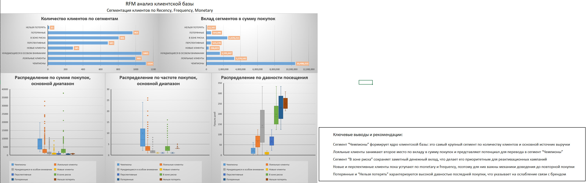

# RFM-анализ клиентской базы

## О проекте

В этом проекте я выполнил RFM-анализ клиентской базы и собрал дашборд в Excel для оценки различий между клиентскими сегментами по трем ключевым признакам:

**Recency** — давность последней покупки  
**Frequency** — частота покупок  
**Monetary** — сумма покупок

Цель проекта — сегментировать клиентов по покупательскому поведению, визуализировать различия между сегментами и сформулировать практические выводы для удержания, развития и реактивации клиентской базы.

## Что было сделано

На основе клиентских данных были рассчитаны RFM-показатели и сформированы сегменты клиентов, включая:

Чемпионы  
Лояльные клиенты  
Нуждающиеся в особом внимании  
Новые клиенты  
Перспективные  
В зоне риска  
Потерянные  
Нельзя потерять

Далее в Excel был собран дашборд, который включает:

распределение клиентов по сегментам  
вклад сегментов в общую сумму покупок  
boxplot-диаграммы по Monetary, Frequency и Recency  
ключевые выводы и рекомендации по работе с сегментами

## Дашборд

## Ключевые метрики

Общее число клиентов: **5926**  
Суммарный monetary: **19 133 878**  
Средний recency_days: **114**  
Средний frequency: **4**  
Число сегментов: **8**

## Основные выводы

Сегмент **«Чемпионы»** формирует ядро клиентской базы. Это самый крупный сегмент по количеству клиентов и основной источник выручки.

**Лояльные клиенты** занимают второе место по вкладу в сумму покупок и представляют потенциал для перевода в сегмент **«Чемпионы»**.

Сегмент **«В зоне риска»** сохраняет заметный денежный вклад, поэтому его можно считать приоритетным для реактивационных кампаний.

**Новые** и **перспективные клиенты** пока уступают по monetary и frequency, поэтому для них особенно важны механики доведения до повторной покупки.

**Потерянные** клиенты и сегмент **«Нельзя потерять»** характеризуются высокой давностью последней покупки, что указывает на ослабление связи с брендом.

## Практическая ценность

RFM-сегментация позволяет не только описать клиентскую базу, но и выделить приоритетные направления работы:

для сегмента «Чемпионы» — удержание и персональные предложения  
для лояльных клиентов — развитие и перевод в более ценный сегмент  
для сегмента «В зоне риска» — реактивация  
для новых клиентов — стимулирование повторной покупки  
для потерянных клиентов — оценка целесообразности возвратных кампаний

## Инструменты

Excel  
RFM-анализ  
Сегментация клиентов  
Boxplot-визуализация  
Dashboard design

## Файл проекта

В репозитории приложен Excel-файл с готовым дашбордом:

`rfm-анализ_дашборд.xlsx`

## Что показывает этот проект

Этот кейс демонстрирует навыки:

анализа клиентской базы  
сегментации пользователей  
интерпретации RFM-метрик  
создания дашбордов в Excel  
формулирования аналитических выводов и рекомендаций для бизнеса
